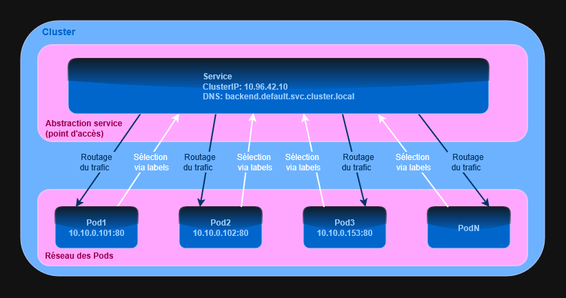
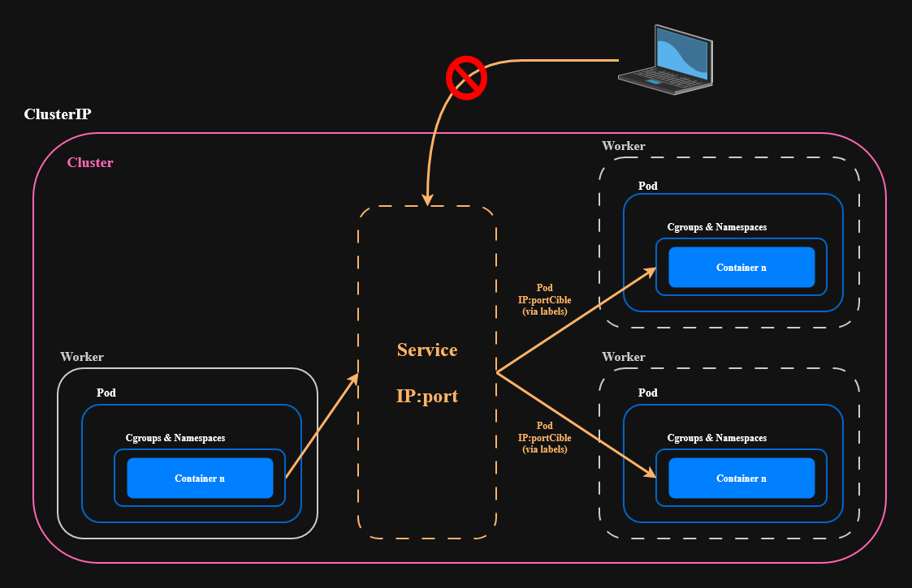

## 🚧 **EN COURS DE REDACTION**
<a id="index"></a>
**Index** :

I. [**Services - Présentation**](#i-services--présentation)
1. [Les rôles d'un service](#1-les-rôles-dun-service)
2. [Fonctionnement d'un service dans un cluster](#2-fonctionnement-dun-service-dans-un-cluster)

II. [**Services - ClusterIP**](#ii-services--clusterip) - Exposition interne cluster

III. [**Services - NodePort**](#iii-services--nodeport) - Exposition externe via port node

IV. [**Services - LoadBalancer**](#ii-services--loadbalancer) - Intégration cloud providers

V. [**Ingress Introduction**](#v-ingress-introduction) - Routage HTTP/HTTPS

VI. [**Ingress Traefik**](#vi-ingress-traefik) (K3s intégré) - Configuration pratique

---
<a id="i-services--présentation"></a>
# I. [**Services : Présentation**](#index)

## 1. Les rôles d'un service

- Un **service** est un objet Kubernetes, comme pour chaque objets, celui-ci est déclaré dans son manifeste.
- Un Service est une **abstraction réseau stable** au-dessus de Pods dynamiques. Il permet de résoudre le problème des IPs dynamiques des Pods, afin d'établir des communication stables, du load-balancing et de la scalabilité.
- Il assure un **point d’accès unique**, avec **load-balancing** vers les Pods correspondants.
- Il permet d’**exposer un point d’accès réseau** vers un ou plusieurs Pods, en interne ou en externe selon son type.
- Il fournit une **adresse IP stable** ainsi qu’un **nom DNS interne**, de la forme :
```bash
<nomDuService>.<namespace>.svc.<clusterDomain>
# Exemple
backend.default.svc.cluster.local
```

>[!IMPORTANT]
>Pour une meilleure compréhension des **services** dans Kubernetes, il faut être familier avec le terme d'**abstraction réseau**.
>
>Une abstraction réseau ne transporte pas le trafic elle-même : elle décrit **comment le trafic doit être routé**.
>
>| **Couche** | **Exemple** | **Rôle** |
>| :---------| :---------| :-----|
>| Abstraction | Service K8s, DNS | Définit _où_ envoyer le trafic |
>| Transport | kube-proxy, iptables, IPVS | Achemine _réellement_ les paquets |
>
>Le Service fournit une **IP virtuelle stable** (ClusterIP) qui pointe vers des Pods éphémères ; c'est kube-proxy qui traduit ça en règles réseau concrètes.
>
>**Analogie** :
>
>Le Service agit comme un panneau de signalisation réseau interne indiquant vers quels Pods le trafic doit être redirigé.

## 2. Fonctionnement d'un service dans un cluster

_Illustration du fonctionnement d'un service dans un cluster_ :


#### **Sélection via labels** :
Lors de sa création, un Service définit un **selector** basé sur des labels.  
Tous les Pods possédant ces labels sont automatiquement **associés au Service**.

Cette association est **dynamique** :
- si un Pod est créé avec les bons labels, il est automatiquement pris en compte
- si un Pod disparaît, il est automatiquement retiré

Le Service n’a donc **aucune connaissance directe des Pods**, il se base uniquement sur leurs labels.

#### **Routage du trafic** :
Lorsqu’un client envoie du trafic vers le Service (via son **nom DNS** ou son **IP**), Kubernetes redirige ce trafic vers **l’un des Pods sélectionnés**.

Le Service fournit :
- un **point d’accès unique et stable**
- un **équilibrage de charge** entre les Pods disponibles

Le client n’a pas besoin de connaître :
- l’IP des Pods
- leur nombre
- leur cycle de vie

>[!IMPORTANT]
>Le Service ne contient pas l’application.
>
>Il fournit une **abstraction stable** permettant d’accéder à des Pods **dynamiques**.

#### **Adresses IPs** :

Quand un cluster Kubernetes est créé, on définit généralement :
- un **CIDR pour les Pods**
- un **CIDR pour les Services**

_Exemple_ :
```text
Pods CIDR     : 10.244.0.0/16
Services CIDR : 10.96.0.0/12
```

Ils sont définis pour ne pas rencontrer de problèmes d'adressage réseau en évitant de faire se chevaucher les plages d'adresses IP des Pods, des services et des Nodes.

## [**Pratique : Création d'un Service**](2-Les-Services_Pratiques.md#i-création-des-premiers-services)

---
<a id="ii-services--clusterip"></a>
# II. [**Services : ClusterIP**](#index)




---
<a id="iii-services--nodeport"></a>
# III. [**Services : NodePort**](#index)


---
<a id="vi-services--loadbalancer"></a>
# IV. [**Services : LoadBalancer**](#index)


---
<a id="v-ingress-introduction"></a>
# V. [**Ingress Introduction**](#index)


---
<a id="vi-ingress-traefik"></a>
# VI. [**Ingress Traefik**](#index)


