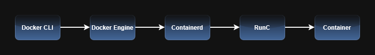
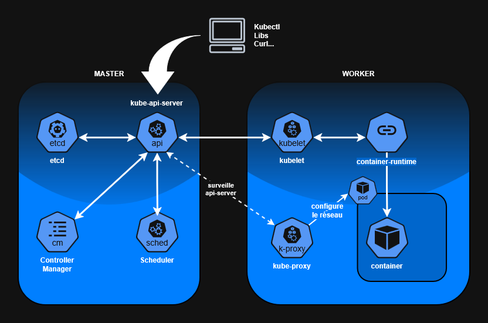
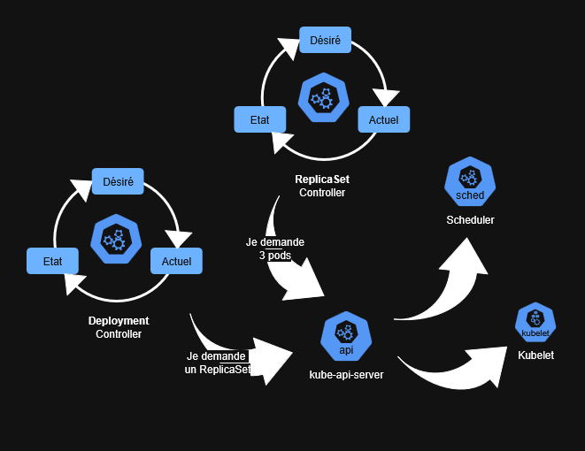
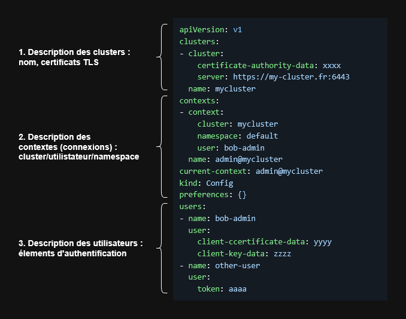
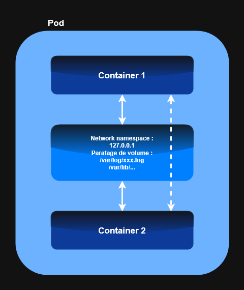
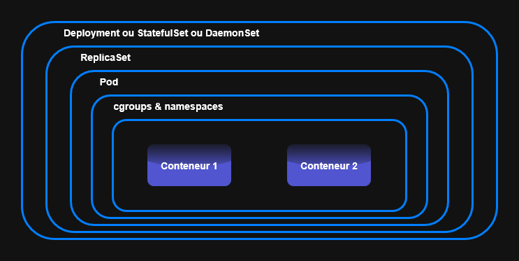
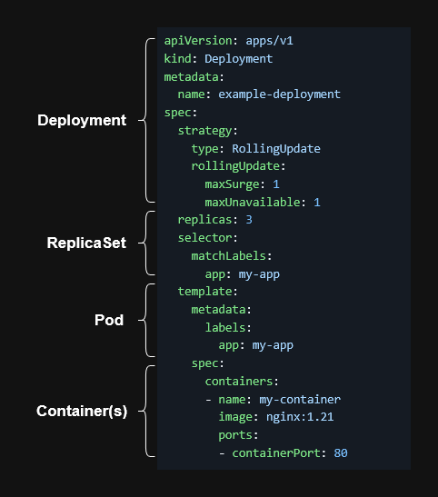
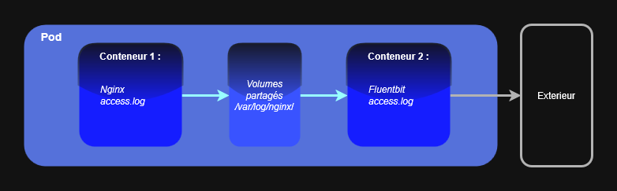
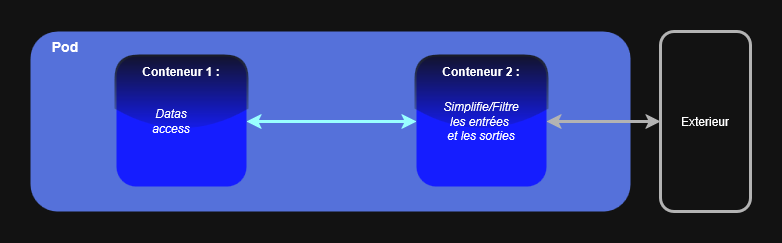
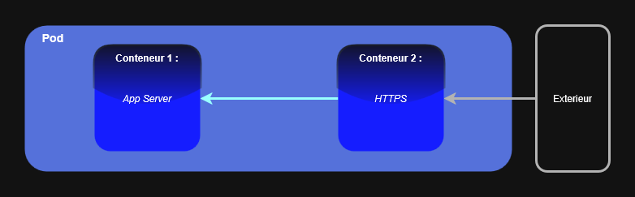

<a id="index"></a>
**Index** :

I. [**Introduction Kubernetes**](#i-introduction-kubernetes)
1. [Présentation de Kubernetes](#1-présentation-de-kubernetes)
2. [Rappel sur la conteneurisation](#2-rappel-sur-la-conteneurisation)
3. [Contexte de Kubernetes](#3-contexte-de-kubernetes)
4. [Solutions techniques apportées par Kubernetes](#4-solutions-techniques-apportées-par-kubernetes)
5. [Solution apportées par Kubernetes](#5-solutions-apportées-par-kubernetes)
6. [Exemples de ce que permet Kubernetes](#6-exemples-de-ce-que-permet-kubernetes)

II. [**Architecture Cluster K8s**](#ii-architecture-cluster-k8s)
1. [Déclaratif vs Impératif](#1-déclaratif-vs-impératif)
2. [Master et Worker](#2-master-et-worker)
3. [Introduction au Pod](#3-introduction-au-pod)
4. [Fonctionnement d'un cluster Kubernetes](#4-fonctionnement-dun-cluster-kubernetes)
5. [Scheduling](#5-scheduling)

III. [**L'APIServer**](#iii-lapiserver)
1. [Point d'entrée de l'APIServer : les clients](#1-point-dentrée-de-lapiserver--les-clients)
2. [Kube-APIServer : Authentification et Autorisation](#2-kube-apiserver--authentification-et-autorisation)
3. [KubeConfig](#3-kubeconfig)

IV. [**Pods**](#iv-pods)
1. [Rappel sur le pod](#1-rappel-sur-le-pod)
2. [Exemple de fonctionnement d'un Pod](#2-exemple-de-fonctionnement-dun-pod)
3. [Contenu d'un Pod](#3-contenu-dun-pod)
4. [Exemple et structure de déploiement](#4-exemple-et-structure-de-déploiement)
5. [Multi-conteneurs](#5-multi-conteneurs)

V. [**ReplicaSets**](#v-replicasets)  - Gestion replicas, self-healing

VI. [**Deployments**](#vi-deployments) - Déploiements déclaratifs, rollouts, rollbacks

---
<a id="i-introduction-kubernetes"></a>
# I. [**Introduction Kubernetes**](#index)

## 1. Présentation de Kubernetes

- Kubernetes est une **plateforme d'orchestration de conteneurs**.
- Standard en virtualisation
- Apporte des solutions, dont sont côté **"agnostique"**. Par exemple, si Kubernetes est mis en place On-prem, en local ou sur des Cloud Provider il fournit globalement le même mode de déploiement. Ce qui lui vaut d'être **flexible** et **portable** (configuré dans un environnement pour le déployer ailleurs) -> Créer donc, un socle commun.
- Travailler avec cet écosystème va apporter une meilleure **résilience du système**.
- Dorénavant, les Cloud Providers fournissent tous du Kubernetes.

## 2. Rappel sur la conteneurisation :

- Elle a apporté Kubernetes
- Apporte un **livrable uniforme** (uniformisation des environnements)
- **Meilleurs performances** des déploiements : **déploiement à l'échelle** et **capacité d'itération** très importantes (ex. : le failfast, la capacité à itérer de plus en plus souvent). Facile de revenir sur des versions antérieur pour satisfaire le besoin des utilisateurs finaux.
- **Facilitation du versioning**; avec la standardisation : capacité à appliquer de la **même manière** une metadata sur un ensemble de code/tout son écosystème.
- Améliorations Opensource, segmente le développement : permet d'embarquer plus de monde sur des petites tâche plutôt que sur un gros projet. Permet aussi la mise en place à grande échelle de projet opensource.
- Facilitation de la mise en place d'architecture nouvelles comme les micro services, le cloud (par exemple des instance de comput), et le DevOps.

### Procédé :

- On installe sur un hôte, au dessus du système d'exploitation un **Container Engine**, il va utiliser les **cgroups** et les **namespaces** dans le but de lancer un processus (ou un groupe de processus) afin qu'il "croie" qu'il est isolé (son propre réseau, hostame, user ...etc.). Il ne verra pas les autre processus qui fonctionnent en parallèle.
- Pas d'émulation de ressources, pas d'OS dédié, moins de maintenance tout en étant isolé.

### **Image** vs **Container**

- **Image** = **le livrable** (le fichier tar.gz avec ses metadata, filesystème, processus lancé et ses dépendances), elle pourra être stocké dans des Registies.
- **Container** = un **processus actif d'une image donnée**. L'image pourra être instancié (avoir plusieurs instance de conteneurs actifs de l'image)

### **cgroups** et **namespaces**

- **cgroups** = allocation de ressources
- **namespace** = isole chaque processus les uns des autres

Docker est un **container-runtime** : il lance les **cgroups** et les **namespaces** pour avoir des container, les manager …etc.

### **Schéma Docker** :



- **Docker CLI** : capacité à télécharger des images pour récupérer des applicatifs et leurs dépendances.
- **Docker Engine** : container runtime de haut niveau, il va ajouter des fonctionnalités au dessus de Containerd pour faciliter son fonctionnement. Management facile des images, containers, réseau et volumes.
- **Containerd** : container runtime de haut niveau, ajoute des fonctionnalités au dessus de RunC pour se "faciliter la tâche". Management d'image partiel, management du réseau et des volumes.
- **RunC** : container runtime de bas niveau, il met en œuvre le modèle **OCI** (Open Container Initiative) -> utiliser les cgroups et namespaces pour lancer et manager **très simplement** un conteneur (il ne manage pas les images).

### Problèmes et solutions

**Problème rencontré en conteneurisation** : pas de mise à l'échelle au niveau de la production.
- **Besoins** :
	- **Clustering**
	- **Orchestration** (mode descriptif, description du besoin)
	- **Mise à l'échelle/Scaling** (adaptation des workload, augmenter le nombre d'instances pour un service donné) permet au clustering d'être malléable.
	- **Autohealing**, facilitation de management des process, avoir un **Control Plan** (une vision d'ensemble) pour manager les process.

## 3. Contexte de Kubernetes

- L'instance Kubernetes est le service le plus utilisé dans le Cloud.
- La meilleure technologie "agnostique", qui fournie une base commune (se configure, déploie globalement de la même manière selon le type d'infrastructure).
- Ecosystème très riche et large, fonctionne par API (API REST) = facilité de développement d'outils à partir de librairies communes permettant d'étendre les possibilités de Kubernetes.
	**Note** : Plus l'écosystème est riche plus il permet d'apporter de solutions.

## 4. Solutions techniques apportées par Kubernetes

- L'agnostique amène un support d'infrastructure hétéroclite, très riche. Possibilité de se tourner vers des **service managés** (EKS, AKS, GKE...), permet un *move to cloud* potentiel, **augmentation de la résilience** en utilisant plusieurs Cloud Providers ou datacenter.
- **Systèmes d'exploitation** dédiés à Kubernetes, ajusté à k8s ils offrent un gain de performances, sécurité (réduction des surfaces d'attaque). Ex. : RancherOS, Talos...
- Un **Installer** pour déployer un cluster Kubernetes. Ex. : *kubeadm*, *kubspray* (installation ansible de Kubernetes avec des configuration plus poussées comme des volumes dynamiques, Ingress Controller...)
- Version de Kubenetes **allégées**, comme k3s (un Kubernetes très épuré), k3d, minikube,microk8s, k0s.

## 5. Solutions apportées par Kubernetes

- **Améliore les déploiement** (méthode GitOps, il pourra être installé au sein du cluster)
- Implémentation de la **haute disponibilité (HA)** au niveau de l'**infrastructure** et des **applicatifs**. Le cluster Kubernetes gérer les deux sans intervention humaine. De la même manière il intègre de l'**auto guérison**.
- Les applications vont pouvoir être **distribuées** et **mise à l'échelle** (Ex. : des modules vont pouvoir venir se greffer sur des modules de mise à l'échelle). Natif à Kubernetes afin d'étendre les capacités du cluster à mesure.
- **Amélioration de l'observabilité** (sans agents, de manière dynamique), grâce à l'API serveur fournie **nativement**.

## 6. Exemples de ce que permet Kubernetes

- Faire **fonctionner une à plusieurs instances d'un même service**. 
- Un **load-balancer intégré nativement** dans l'écosystème va grandement **faciliter le routage du trafic entre les instances**. Simplification de la maintenance, configuration.
- Faire **varier les instances automatiquement** ou **manuellement** de manière **déclarative**.
- Il permet de s'**assurer qu'une instance est prête à recevoir le trafic**.
- Il permet de **choisir/ajuster** comment k8s va réaliser les **mise-à-jour d'applicatifs**.
- Manager la **topologie des nodes** (attribution de ressources)
- **Orchestrer des workloads différents** comme des daemons, du batch processing & scheduling (avec cronjobs)
- **Manager** et **opérer** des bases de données. Via des outils tiers qui viennent se greffer facilement à Kubernetes.

---
<a id="ii-architecture-cluster-k8s"></a>
# II. [**Architecture Cluster K8s**](#index)

## 1. Déclaratif vs Impératif

Le changement de paradigme (impératif vers déclaratif) est au cœur de l'architecture de Kubernetes, tout passe par l'API de Kubernetes. C'est le point d'entré pour le système déclaratif qui permet de faire fonctionner le cœur de Kubernetes (l'orchestration).

 **Impératif** :
- Peu courant, mais il est encore utilisé, souvent utilisé par le mode déclaratif.
- L'action est exécutée **directement** par le demandeur 
	
>[!NOTE]
>**Exemple** :
>Exécution de la commande `sudo apt install nginx` dans un terminal.
	
- **Contrôle sur l'action effectuée** (l'action et le temps sont contrôlés par le demandeur)
- L'action **doit être managé, configurée et exécuté** par le demandeur.
- Analogie : On **décrit en détail "comment"** on fait/gère les choses.

**Déclaratif** : 
- Permet d'avoir une approche **descriptive**. L'état final est décrit, un système va assurer la mise en place de la description 
	
> [!NOTE]
> **Exemple** :
> On décrit la version de nginx ainsi que ses configuration souhaitée et un système va procéder à l'installation (ex. Ansible)

- **Moins de contrôle** sur les actions réalisées, mais **plus d'action déléguées** à d'autre personnes.
- Analogie : On **décrit ce que l'ont "veut"** installer.

## 2. Master et Worker

Ils assurent et assument la fonction déclarative mise à disposition par Kubernetes. Le mode déclaratif va géré l'ensemble des états possible et tenter d'assumer et garantir l'état déclaré.

 **Master** :
- Une **master node** est un **support d’exécution** (machine / VM / instance) sur lequel tournent des composants du **control plane**. Le **control plane** est l’**ensemble logique** de ces composants.
- Contrôle l'état du cluster (sur les couche serveur et applicatives), il va garantir que ce qui a été déclaré est maintenue et maintenable.
- Il reçoie les instructions par une API et les stock dans une base de donnée.
- Les masters reçoivent la connexion cliente (CLI, librairies...) vers l'API serveur de manière sécurisée (Authentification et Autorisation).

> [!NOTE]
> **Rappel** :
> **Autorisation** : vérifier les permissions (que pouvez-vous faire ?)
> **Authentification** : vérifier l'identité (qui êtes-vous ?)

- Il faut un nombre impair de Masters, beaucoup de protocoles (ex. raft) se reposent sur un "leader" et des "followers" qui doivent être élus à l'unanimité (pas d'ex-aequo possible).
- Ils sont souvent peu configurable et gérés par le Cloud provider.

 **Worker** :
- Ils peuvent êtres configurés avec des profils différents (ex. avec GPU, sans GPU, avec ARM...etc.). Permettent d'**adapter/manager les workloads** installés sur les Worker.
- Ils fournissent les **capacité de calcules**, la **RAM**, **GPU** afin d'économiser les ressources.
- Ils sont **configurables**, et sont les éléments sur lesquels on **agit** (ex. : étendre le nombre de Worker, créer des pools de Worker...etc.)

## 3. Introduction au Pod

- C'est la plus petite unité gérée par Kubernetes.
- Il peut être composé d'**un ou plusieurs containers**.
- Il va permettre de **mutualiser/partager certains namespace** (réseau, IPC…) ainsi que des **volumes**, afin de **fonctionner ensemble** comme **une seule entité logique**. Il permet donc de réduire volontairement l'isolation entre containers qui doivent travailler ensemble.

> [!NOTE]
> **Exemple** :
> L'adresse de boucle locale 127.0.0.1 d'un Pod donné va être la même pour les containers qui le composent.

## 4. Fonctionnement d'un cluster Kubernetes



En administration on peut accéder au master via la commande `kubectl` ou des terminaux graphiques comme *k9s*. 
`kubectl` est un client qui communique de manière **sécurisée** (certificats, autorisation, authentification) avec une API. Le but étant d'envoyer des requêtes à l'API-server (API en REST). Ces requêtes peuvent aussi être envoyé par des **librairies** (python, Go, etc.) ou du `curl`.

Typiquement on retrouve nos **2 types** de serveurs :

### **Node Master** :

- **kube-api-server** : Premier point d'entrée dans le cluster Kubernetes. Située dans le Control Plan (**Rappel** : le Control Plane est **l’ensemble logique des composants** Kubernetes qui pilotent l’état du cluster.) 
- **etcd** : La **base de donnée** qui permet de **stocker les informations** du cluster (les manifestes, l'état du cluster, ses noeud/spécificités, les application déployées, etc.)
- **Controller Manager** : Applicatif qui permet de mettre à disposition un **ensemble de contrôleur**. 
	- Il communique avec l’API Server afin d’observer l’état du cluster (persisté dans *etcd*) et d’en déduire le travail à effectuer. 
	- Chaque contrôleur est responsable d’un type de ressource (Deployments, ReplicaSets, Jobs, Nodes, etc.). 
	- À partir des informations récupérées, les contrôleurs comparent en continu l’état actuel et l’état souhaité afin de déterminer les actions à entreprendre. 
	- Les décisions prises peuvent déclencher des réactions d’autres contrôleurs, chacun réagissant à l’état global du cluster.
- **Scheduler** : Composant chargé de sélectionner la node la plus appropriée pour exécuter un Pod, en tenant compte des ressources disponibles et des contraintes définies, à l’aide de mécanismes de filtering et de scoring.

### **Node Worker** :

- **kubelet** : C'est un agent de Kubernetes qui va être déployé sur les workers. Il va prendre en charge les actions déterminées par le *Scheduler* et les *Controllers*.
- **container-runtime** : De bas niveau (*RunC*) ou de haut niveau (*containerd*). 
	- Le *kubelet* va manager et passer les actions au *container-runtime*. 
	- **Rappel** : Il gère les *cgroups* (affectation des ressources) et *namespaces* (création de l'isolation afin que les processus des containers ne puissent être vus des processus de la même machine).
- **kube-proxy** : Applicatif (*DaemonSet*) dédié à la **communication** à l'**intérieur** et à **l'extérieur** du cluster (sous forme de règle *iptables* ou d'IPVS). Son rôle est de maintenir les règles iptables/IPVS pour le routage réseau des Services.

## 5. Scheduling

Dans Kubernetes, lorsqu'on demande la création d'un Deployment ou d'un Pod, le plan de contrôle **orchestre automatiquement** le **placement**, la **création** et la **gestion** des conteneurs sur le cluster. Le **scheduling** correspond au processus par lequel le cluster choisit sur quel nœud exécuter un Pod lors de sa création.

### **ETCD** :

- **Accessible uniquement via l'*APIServer***. Des informations seront déposées via la commande `kubectl`, des librairies, curl, mais aussi du cluster lui-même, sous forme **clé/valeur**.
- Les informations stockées dans la base de donnée *etcd* représentent l'**état du cluster dans son ensemble** (l'état du serveur, les configurations, l'état des Pods, les secrets, etc.).

>[!IMPORTANT]
>**La boucle de réconciliation** :
>Afin de créer une base d'**état souhaitée**, les composants du plan de contrôle, comme le *controller manager* et ses contrôleurs ou le *scheduler*, **modifient l’état du cluster via l’API Server**, qui persiste dans *etcd*. Cet **état souhaité est ensuite comparé à l’état réel** du cluster afin que Kubernetes entreprenne les actions nécessaires pour **converger vers cet état**. »

- Cette base de donnée **clé/valeur** repose sur l'**algorithme raft**, qui met en place un système d’élection par vote **basé sur une majorité**. Il est donc recommandé d'utiliser un nombre **impair** de nœuds afin d'éviter les blocages et permettre d'élire un **leader**.
- L'*etcd* est capitale au fonctionnement du cluster, ce quorum permet de se prémunir afin d'optimiser la **tolérance au pannes**, contre les échecs et éléments à risque comme les mises à jour.
- En tant que base de donnée il est préférable de faire des backups de l'*etcd*.

>[!NOTE]
>Backup direct de la base de donnée *etcd* avec les lignes de commandes `etcdctl` ou avec des outils dédiés à la sauvegarde et à leur management.

- Les performances doivent être **stables et suffisantes** (ssd, pas de latence réseau, etc.).

### **Controller Manager et contrôleurs** :

- Il gère les contrôleurs natifs à Kubernetes et les contrôleurs tiers.
- Le contrôleur est une fonction qui prend un **état désiré**, le compare à un **état réel** et en **conclue des actions à effectuer**. Chaque contrôleurs fait ce travail sur un composant logique donné au niveau du cluster (ex. : un pour les Deployments, un pour les noeuds, un pour les ReplicaSets, etc.).

>[!NOTE]
>Ressource de développement (boucle) du fonctionnement d'un contrôleur :
>```js
>for {
>	desired := getDesiredState()
>	current := getCurrentState()
>	makeChanges(desired, current)
>	}
>```

- Il est possible d’installer un **opérateur**, celui-ci étend Kubernetes en ajoutant de nouvelles ressources via des **Custom Resource Definitions (CRD)**. Ces ressources étant spécifiques, elles nécessitent un contrôleur dédié (fourni par l’opérateur) pour les gérer.
- On trouve deux types de contrôleurs :
	- **kube-controller-manager** : Exclusif et interne à Kubernetes.
	- **cloud-controller-manager** : Permet d'interagir avec des éléments du Cloud externe.

**Illustration du fonctionnement des boucles de réconciliation** :

### **Scheduler** :

- Il va **prendre en charge les Pods non assignés** afin des les **allouer** de manière à ce qu'ils soient dédiés à des nodes Worker.
- Deux mécanisme le composent :
	- Le **filtering** : Il va trier les serveurs par rapport au besoins. Il va écarter de la règle finale de calcule les serveurs qui ne doivent pas être pris en compte.
	- Le **scoring** : Un fois qu'un pool de serveur potentiel est filtré, le scoring va noter les serveurs afin d'attribuer le pod.
- Le *scheduler* va éditer le *nodeName* de chaque pod par l'*APIServeur* vers l'*etcd* afin que le *kubelet* puisse lire ces informations.
- Il peut imposer des contraintes à chaque pod : best effort, guranteed, burstable. Il s'agit de la **sensibilité** des pods (ex. : est ce qu'on veut que le pod soient détruit en dernier recours, ou qu'il soit détruit et recréé à notre convenance).
- Le *scheduler* peut aussi fournir des métriques sur la planification.

>[!IMPORTANT]
> Plus les informations fournies au *scheduler* et au *conrtôleurs de déploiement* sont exactes, plus l'allocation et les actions menées seront précises et correctes.

### **Kubelet** :

- Il **vérifie** en **permanence** l'*APIServer*.
- Il va interroger l'*APIServer*, s'il y a un *nodeName* dont il a la charge, il le prend en charge puis demande au *Container-Runtime* :
	- Téléchargement de l'image OCI ; 
	- Gérer ce conteneur (création, etc) ;
	- Montage du volume et du réseau.
- Durant cette étape, un pod possède différents états :
	- **pending** : en attente de disponibilité du conteneur ;
	- **running** : le conteneur est en cours d'exécution ;
	- **failed** : le processus de lancement du conteneur a généré une erreur ;
	- **succeeded** : le processus s'est terminé sans erreur (ex. : un conteneur est lancé, contenant la commande `sleep 60`, le container s'arrêtera il ne sera plus en état **running** après une minute et son état passera à **succeeded** car la commande aura réussie).
- Le *kubelet* **remonte des informations** à l'*APIServer* pour le tenir informé afin qu'il en déduise des action éventuelles.

---
<a id="iv-lapiserver"></a>
# III. [**L'APIServer**](#index)

## 1. Point d'entrée de l'APIServer : les clients

### **Kubectl**:
- Client officiel Kubernetes
- C'est l'outil CLI permettant d'interagir avec le *kube-apiserver*
- Communique avec l’API Server via des **requêtes HTTP REST (JSON/YAML)**

**Fonctionnement**:
- **kubectl n'accède jamais directement aux noeuds**
- Toutes les commandes passent par :
```nginx
kubectl → kube-apiserver → etcd / scheduler / controller-manager
```
- Authentification, autorisation et admission sont **gérées par l'APIServer**

**Configuration**
- Utilise le **kubeconfig** (`~/.kube/config`) qui contient les éléments suivants :
	- Cluster (URL de l'APIServer)
	- Identité utilisateur
	- Namespace par défaut
	- Méthode d'authentification (certificat, token, OIDC, etc.)

### **Autres clients de l'APIServer**
- **Client REST direct**
	- `curl`
- **Clients programmatiques (SDK officiels)**
	- **Go** : `client-go` (le plus utilisé, cœur de Kubernetes)
	- **Python** : `kubernetes-client/python`
	- **Java**
	- **JavaScript / TypeScript**
- Ces clients utilisent les **mêmes endpoints que `kubectl`**

## 2. Kube-APIServer : Authentification et Autorisation

- C'est une API en **REST** (REpresentational State Transfert), 
	- Permet d'utiliser différents types de paramètres (verbe de la requête HTTP, Path de la requête HTTP, envoie de données à travers une requête HTTP), afin de réaliser une action.
	- Verbes utilisés : 
		- **GET** : récupération d'informations
		- **POST** : création d'une ressource avec ses caractéristiques
		- **PUT** : mettre à jour l'intégralité de la ressources
		- **DELETE** : suppression de la ressource
		- **PATCH** : modification d'éléments dans la ressource
- C'est une **interface** Client/Serveur
- Elle fait du **RBAC** (Role Base ACess, association entre l'utilisateur et le rôle) en gérant deux niveau de sécurité : 
	- l'**authentification** (est-ce que la personne existe et utilise les bonne crédenciales, via un certificat client ou des tokens)
		- par **utilisateur ou application** (*kubelet*, *kube-proxy*) par le biais de certificats (TLS) ou de token
		- par **pods**, chaque pods peut avoir un **compte de service** avec un token, pour pouvoir interagir directement avec le cluster Kubernetes.
	- l'**autorisation** (est ce que la personne authentifiée à les droits pour réaliser les actions désirée).
		- Les autorisations dans Kubernetes reposent sur le modèle **RBAC**, qui définit ce qu’un utilisateur ou un service peut faire sur une ressource donnée, via la combinaison : _API Group / Resource / Action (verbe)_

**Exemple d’un fichier de règles RBAC**:
```yaml
kind: Role
apiVersion: rbac.authorization.k8s.io/v1
metadata:
  namespace: default
  name: pod-reader
rules:
- apiGroups: [""] # L'API Group à utiliser (API par défaut ou API spécifiques)
  resources: ["pods"] # Ressources sur lesquels on va effectuer les opérations.
  verbs: ["get", "watch", "list"] # Les verbes à passer
```

### **Kube APIServer et groupes API**

On trouve **deux familles** de groupes :
- **core** (aussi appelé **legacy**) : il contient les ressources fondamentales de Kubernetes (ex. : les pods, services, ConfigMaps, secrets, namespaces). 
	- Chemin d'API : `/api/v1`
- **named groups** : les API Groups nommés organisent les fonctionnalités avancées par domaine (applications, réseau, sécurité…).
	- Chemin d'API : `/apis/$GROUP_NAME/$VERSION`

*Exemple*:
```bash
/api/v1              → core
/apis/apps/v1        → applications
/apis/batch/v1       → jobs
/apis/networking...  → réseau
/apis/rbac...        → sécurité
```

Dans un cluster Kubernetes on peut retrouver ces groupes dans le résultat de la commande:
```bash
kubectl api-resources
```

>[!NOTE]
>Il y a plusieurs niveau de versions :
>- `v1alpha<x>` : version expérimentales, modifiable par la communauté et développeurs notifications.
>- `v1beta<x>` : version plus stable, activée par défaut dans le cluster.
>- `v<x>` : version stable, rétrocompatibilités assurées.

Il est possible de crée ses propres groupes quand on créé ses propres ressources avec les **CRD** (Custom Resource Definition) :
```yaml
apiVersion: apiextensions.k8s.io/v1
kind: CustomResourceDefinition
metadata:
  name: myobject.bob.fr
spec:
  group: bob.fr
  versions:
    - name: v1
      served: true
      storage: true
  scope: Namespaced
  names:
    plural: myobjects
    singular: myobject
    kind: MyObject
    shortNames:
    - mobj
```

Dans cet exemple, le champ `scope` détermine la **portée de la ressource** (namespace ou cluster). En spécifiant `Namespaced`, la ressource appartient à un namespace et son nom doit être unique à l’intérieur de ce namespace. Kubernetes empêchera donc la création de deux ressources portant le même nom dans un même namespace.
Les objets créés/déclarés à partir de la CRD seront ensuite traités par un contrôleur qui observe les ressources, puis exécute les actions nécessaires pour faire converger l’état réel vers l’état désiré.

## 3. KubeConfig

Le fichier est appelé **KubeConfig** d'après sa variable `echo $KUBECONFIG`. Le fichier est stocké par défaut dans `~/.kube/config`.
Par défaut, il permet de définir l'accès à **un** cluster Kubernetes avec les crédenciales associées.
Si, on veut avoir accès à plusieurs cluster Kubernetes, on peut éditer la variable `$KUBECONFIG`, mais aussi modifier le fichier en y ajoutant les nouveau clusters

**Exemple d'un fichier KubeConfig** :




---
<a id="iii-pods"></a>
# IV. [**Pods**](#index)

Le pod est un l'objet logique central de Kubernetes, il permet de manager des services et des applicatifs au niveau du cluster.
## 1. Rappel sur le pod

- C'est un objet logique qui permet de regrouper un ou plusieurs conteneurs dans un même **contexte**.
	- Il existe **différents types** de conteneurs qui vont être lancés en séquence (des container lancés à l'init du pod, d'autres à la fin, et des container qui vont fonctionnés tout au long de la vie du pod).
	- Il existe des conteneurs **"sidecar"** qui vont utiliser ou étendre les possibilités d'un conteneur central (ex. : monitoring, log, etc.).
- Le pod est la plus **petite unité** au niveau de Kubernetes. 

>[!WARNING]
>Le conteneur n'est pas la plus petite unité au niveau de Kubernetes. Ce n'est pas Kubernetes qui manage le conteneur mais le **container-runtime**.

- Les conteneurs dans un pod disposent du **même réseau** et du **même stockage** à disposition.
- Le pod est l'objets le plus important pour les opérations de *scaling* (mise à l'échelle). 
	- Le **Horizontal Pod Autoscaling** (HPA) est le plus couramment utilisé. Il permet d’augmenter ou de réduire automatiquement le nombre de Pods d’un workload lorsque la charge devient trop importante.
	- Le **Vertical Pod Autoscaler** (VPA), bien que moins utilisé, permet d’ajuster automatiquement les ressources (CPU et mémoire) allouées aux Pods en fonction de leur consommation réelle.

## 2. Exemple de fonctionnement d'un Pod



- Les deux conteneurs sont dans les mêmes *namespaces*. Le *network namespace* pourra être partagé/mutualisé par le container 1 et le container 2, ils utiliserons donc le même réseau. 
- Ils peuvent aussi partager des volumes (locaux, montés, etc.). Par exemple, si un troisième conteneur de supervision est ajouté sur ce même pod, celui-ci pourrait accéder aux fichiers de logs partagés, comme `/var/log/xxx.log` (ce troisième conteneur est un exemple de conteneur **"sidecar"**).

## 3. Contenu d'un Pod

Il se présente souvent sous forme de manifeste en .yaml ou .json. Ce fichier se compose de plusieurs parties :

```yaml
apiVersion: v1
kind: Pod
metadata:
  name: multi-container-pod
spec:
  containers:
  - name: nginx-container
    image: nginx:latest
    ports:
    - containerPort: 80
  - name: redis-container
    image: redis:latest
    ports:
    - containerPort: 6379
```

- On commence par décrire l'*APIVersion*, ici le terme *v1* indique qu'on est sur l'API principale de Kubernetes.
- On décrit le *kind*, c'est-à-dire le type d'objet déployé. Ici, il s'agit d'un *Pod*.
- La description des *metadatas* à l'aide d'un nom de pod, de namespaces, de labels ou d'annotations, va permettre de différencier le pod par rapport à d'autres pods potentiellement créés.

>[!NOTE]
>**Metadata namespaces** :
>Certains pods ou objets vont être *"namespacés"* (**namespaced**). Un pod avec un nom donné dans un namespace N1, pourra être créé avec le même nom dans un namespace N2.

- La partie *spec*, correspond au **bloc descriptif des spécifications du pod**. Il s'y trouve la description des différents conteneurs du pod avec leur **nom**, le **registre avec l'image**, le **port réseau**, mais aussi des **commandes**, les **arguments**, les **volumes** et **configuration réseau**, etc.

>[!WARNING]
>Dans un contexte d’HPA (Horizontal Pod Autoscaling), il faut être vigilant à la composition des pods.  
Si un pod contient à la fois un conteneur applicatif et un conteneur de base de données, **la mise à l’échelle du pod entraînera la réplication des deux conteneurs**, y compris celui de la base de données, **ce qui peut provoquer des incohérences de données, des conflits d’accès ou des problèmes de persistance**.

- Le plus souvent les pods **ne seront pas créés avec ce type de manifeste de pod**. En effet, les pods sont gérés par les contrôleurs, ils seront donc **créés à travers des contrôleurs** d'autres objets comme un manifeste de **ReplicaSets**, ou plus communément un manifeste de **Deployment**, de **DaemonSets** et de **Statefulset**. Les pods ne sont donc pas "manipulés" directement.

## 4. Exemple et structure de déploiement
### **Analogie couramment utilisée pour décrire la structure de Kubernetes : "les poupées Russes"** :



On peut comparer Kubernetes à des **poupées russes** : chaque niveau en contient un autre.  
Le pod est une poupée qui contient un ou plusieurs conteneurs.  
Avec l’HPA, lorsqu’on met à l’échelle, **on ne duplique pas un conteneur seul, mais la poupée entière**, c’est-à-dire le pod et tout ce qu’il contient.

**Exemple d'un manifeste de Deployment** :

```yaml
apiVersion: apps/v1
kind: Deployment # On décrit le type d'objet, ici un déploiement
metadata:
  name: example-deployment
spec: # les spécifiactions de ce déploiment
  strategy:
    type: RollingUpdate
    rollingUpdate:
      maxSurge: 1
      maxUnavailable: 1
  replicas: 3 # Nombre de pods souhaités pour ce déploiement
  selector: # Permet de choisir/fitrer les pods à asssocier au réplicats
    matchLabels: # Les labels qui vont permettre de déterminer le/les pods
      app: my-app
  template: # Modèle de pod à créer
    metadata:
      labels: # Labels appliqués aux pods (doivent matcher le selector)
        app: my-app
    spec:
      containers: # Liste des conteneurs du pod
      - name: my-container
        image: nginx:1.21
        ports:
        - containerPort: 80
```




## [**Mise en pratique : création d'un cluster k0s**](Bloc-1-Pratique.md#i-mise-en-place-dun-cluster-k0s)
## [**Mise en pratique de `kubectl` & `curl`**](./Bloc-1-Pratique.md#ii-kubectl--curl)
## [**Lancement des premiers Pods**](./Bloc-1-Pratique.md#iii-lancement-des-premiers-pods)

## 5. Multi-conteneurs

### **_init container_ et conteneur de "stop"/ `preStop`**

***init container*** :
- Fonctionnalités :
	- Préparation de l'environnement
	- Attente d'une dépendance
	- Faire une migration 
- Il est **séquentiel** et **non permanent**
- Il **ne partage pas le cycle de vie** du conteneur principal.

**Conteneur de "stop" / `preStop`** :
- Il **n'est pas un conteneur dédié**
- C'est un **hook du cycle de vie**
- Fonctionnalités :
	- Drainer les connexions
	- Fermer proprement un service

### **Les Patterns**:

Par convention, un pod multi-conteneurs est généralement motivé par un ou plusieurs **patterns**, même si ce lien est aujourd’hui moins systématique. On trouve :
- **sidecar**
- **adapter**
- **ambassador**

**Le _sidecar_** :

Son rôle est d'**étendre les capacités** d'un autre conteneur.
- *Exemple* : logs, monitoring, etc.


Dans cet exemple on monte le volume partagé */var/log/nginx/* du conteneur 1 pour le partager au conteneur 2. Ainsi, dans ce cas, le deuxième conteneur va pouvoir lire les logs et les envoyer vers l'extérieur du pod.

**L'_adapter_** :

Son rôle est de normaliser, simplifier et transformer les données ou interfaces échangées entre le conteneur principal et son environnement, afin de les rendre compatibles avec des systèmes externes.
- *Exemple* : monitoring



**L'_ambassador_** :

Son rôle est de gérer, simplifier et sécuriser les communications échangées entre le conteneur principal et son environnement réseau, afin de les rendre compatibles avec des services externes.
- *Exemple* : proxy, TLS end to end, etc.


Dans cet exemple, si le conteneur 1 veut communiquer avec un autre conteneur 1 situé dans **un autre pod**, celui-ci utilisera le conteneur 2 (HTTPS) comme intermédiaire afin de chiffrer le trafic entre les deux conteneurs 1.

>[!NOTE]
>Même s'il existe trois patterns qui ont leurs propre rôles, elles sont communément regroupées sous l'étiquette **sidecar**.

## [**Pods : Multi-Conteneurs**](./Bloc-1-Pratique.md#iv-pods--mutli-conteneurs)

---
<a id="v-replicasets"></a>
# V. [**ReplicaSets**](#index)


---
<a id="vi-deployments"></a>
# VI. [**Deployments**](#index)

